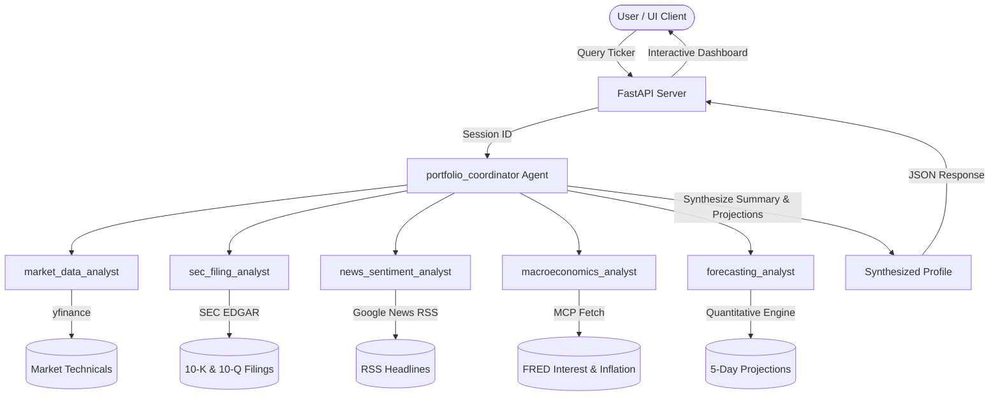

# AlphaInsight: Multi-Agent Trading & Market Risk Copilot

AlphaInsight is a production-grade multi-agent financial copilot designed to synthesize corporate risk profiles, market sentiment, technical indicators, and macroeconomic data into structured investor reports. Built on the **Google Agent Development Kit (ADK)** and deployed to **Google Cloud Vertex AI Agent Runtime** and **Hugging Face Spaces**.

---

## 1. Problem Statement
Retail and professional investors face an overwhelming deluge of unstructured data: thousands of pages of SEC filings containing boilerplate text, shifting news headlines, technical price movements, and macroeconomic signals. Synthesizing this manually for multiple stocks is time-consuming and error-prone. AlphaInsight automates this by coordinating specialized agents to extract, filter, analyze, and synthesize these inputs on-demand.

## 2. Target Users
* **Retail Investors** looking for consolidated corporate risk summaries.
* **Financial Analysts** needing quick side-by-side risk and technical comparisons.
* **Portfolio Managers** requiring real-time sentiment analysis and macroeconomic alignment.

## 3. Selected Capstone Track: Agents for Business
AlphaInsight falls under the **Agents for Business** track. It solves a real-world financial research and insights generation problem, helping users synthesize complex structured and unstructured business intelligence data to make informed decisions.

---

## 4. Key Capstone Concept Mapping

| Key Concept | Implementation Details |
| :--- | :--- |
| **Agent / Multi-agent system (ADK)** | Orchestrated via Google ADK (`Agent`, `Runner`, `App`). Implements a Chief Investment Officer (`portfolio_coordinator`) routing tasks to 5 specialized sub-agents. |
| **MCP Server** | Implements the **Model Context Protocol (MCP)** via the `mcp-server-fetch` tool, allowing the Macroeconomics Agent to scrape live FRED tables in real-time. |
| **Security features** | Strict Pydantic v2 validation, secure UUIDv4 session management, path-traversal prevention, prompt injection filtering, and automatic fail-safes (no synthetic data fallback). |
| **Deployability** | Deployed as a Vertex AI Reasoning Engine on GCP and containerized via Docker for public hosting on Hugging Face Spaces. |
| **Agent skills (Agents CLI)** | Built using ADK `adk deploy` packaging and verified via automated python evals. |

---

## 5. System Architecture & Workflow



### Agent Responsibilities & Tool Mapping
1. **Chief Investment Officer (`portfolio_coordinator`)**: Orchestrates sub-agent tasks, manages history, validates guardrails, and merges analysis.
2. **Market Technical Analyst (`market_data_analyst`)**: Computes real-time RSI, MACD, and SMA crossovers using the `yfinance` tool.
3. **SEC Filing Analyst (`sec_filing_analyst`)**: Maps CIKs, retrieves the latest 10-K and 10-Q filings, skips early Table of Contents occurrences, and parses Item 1A Corporate Risk Factors.
4. **News Sentiment Analyst (`news_sentiment_analyst`)**: Downloads headlines from Google News RSS feeds and sentiment-scores them.
5. **Macroeconomics Analyst (`macroeconomics_analyst`)**: Fetches interest rate (FEDFUNDS) and inflation (CPI) tables from FRED using **MCP Fetch**.
6. **Forecasting Analyst (`forecasting_analyst`)**: Uses historical prices to run a 5-day quantitative projection.

---

## 6. Security & Grounding Guardrails
* **No Synthetic Data Fallbacks**: If yfinance or SEC EDGAR is unreachable, the system fails gracefully with explicit errors rather than fabricating prices or mock risks.
* **UUIDv4 Sessions**: Sessions are strictly validated using `UUIDv4` regex and Pydantic schemas, blocking path-traversal or history-injection attempts.
* **Prompt Injection Defense**: Input validation filters out systemic prompt commands to avoid altering coordinator instructions.
* **Non-Advice Boundaries**: Agent output filters block requests for specific buy/sell recommendations or financial planning, appending a mandatory risk disclaimer to all outputs.

---

## 7. Installation & Local Execution

### Prerequisites
* Python 3.10+
* Git
* A Google Gemini API Key or GCP Project configured with Application Default Credentials (ADC).

### Setup Steps
1. Clone the repository:
   ```bash
   git clone https://github.com/ddkxip/market-risk-profile-agent.git
   cd market-risk-profile-agent
   ```
2. Create and activate a virtual environment:
   ```bash
   python -m venv .venv
   # Windows:
   .\.venv\Scripts\activate
   # Mac/Linux:
   source .venv/bin/activate
   ```
3. Install dependencies:
   ```bash
   pip install -r requirements.txt
   ```
4. Configure environment variables in a `.env` file at the root:
   ```env
   GOOGLE_GENAI_USE_VERTEXAI=true
   GOOGLE_CLOUD_PROJECT=your_gcp_project_id
   GOOGLE_CLOUD_LOCATION=us-central1
   # Or set:
   # GEMINI_API_KEY=your_gemini_api_key
   PORT=8000
   HOST=127.0.0.1
   ```
5. Start the web server:
   ```bash
   uvicorn app.main:app --host 127.0.0.1 --port 8000 --reload
   ```
6. Open your browser to `http://localhost:8000`.

---

## 8. Running Evaluations
AlphaInsight includes an evaluation suite that tests multi-agent synthesis latency, CIK matching, path traversal rejection, prompt injection mitigation, and forecast validation:
```bash
python evals/run_evals.py
```

---

## 9. Deployment Reference

### Google Cloud Vertex AI (Reasoning Engine)
To deploy the agent core as a serverless Reasoning Engine:
```bash
adk deploy agent_engine --project=YOUR_PROJECT --region=us-central1 --display_name="AlphaInsight" ./deploy_dist
```

### Hugging Face Spaces (Web Application)
The web application is containerized via the root `Dockerfile` and hosted publicly on Hugging Face Spaces. The continuous integration workflow under `.github/workflows/huggingface_sync.yml` automatically builds and deploys changes.

---

## 10. Responsible AI & Financial Disclaimer
**Disclaimer**: AlphaInsight is a data synthesis copilot designed for educational and informational purposes only. It does NOT provide investment, trading, or financial planning advice. All technical indicators, sentiment ratings, and forecasts are generated algorithmically and should not be used as the sole basis for any financial transactions. Always perform independent due diligence.
